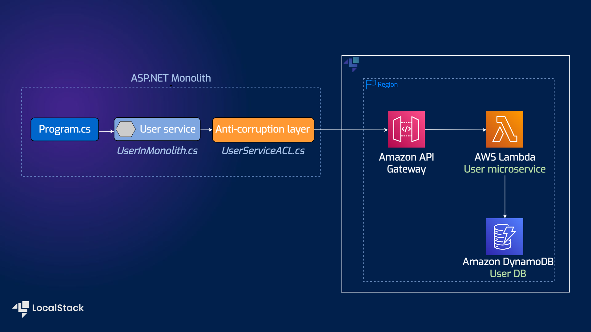

# Anti-Corruption Layer pattern with .NET, API Gateway, Lambda, and DynamoDB

| Key          | Value                                                                                 |
| ------------ | ------------------------------------------------------------------------------------- |
| Environment  |                                                                       |
| Services     | API Gateway, DynamoDB, Lambda                                 |
| Integrations | CDK                                                                            |
| Categories   | Serverless; Microservices; Software Architecture                                                   |
| Level        | Intermediate                                                                            |
| GitHub       | [Repository link](https://github.com/localstack-samples/sample-anti-corruption-layer-pattern)   |

## Introduction

The sample application implements an Anti-Corruption Layer (ACL) pattern to act as a mediation layer that translates the domain model semantics from one system to another system. It translates the upstream bounded context’s (monolith) model into one that suits the downstream bounded context (microservice) before consuming the communication contract established by the upstream team. 

In this sample application, a user microservice has been strangled out of the ASP.NET monolith application. The user microservice has been deployed as a Lambda function on AWS and calls to the Lambda function are routed through an API Gateway. An anti-corruption layer has been deployed in the monolith that translates the call to adapt to the semantics of the user microservice.

Users can deploy this application on LocalStack and AWS with no changes using Cloud Development Kit (CDK). To test this application sample, we will demonstrate how you use LocalStack to deploy the infrastructure on your developer machine and your CI environment.

## Architecture diagram

The following diagram shows the architecture that this sample application builds and deploys:



We are using the following AWS services and their features to build our infrastructure:

- [DynamoDB](https://docs.localstack.cloud/user-guide/aws/dynamodb/) to store the user data for the user microservice implementation.
- [API Gateway](https://docs.localstack.cloud/user-guide/aws/apigateway/) to expose the user microservice implementation as a REST API.
- [Lambda](https://docs.localstack.cloud/user-guide/aws/lambda/) to host the user microservice implementation, exposed via API Gateway.

## Prerequisites

- LocalStack Pro with the [`localstack` CLI](https://docs.localstack.cloud/getting-started/installation/#localstack-cli).
- [Cloud Development Kit](https://docs.localstack.cloud/user-guide/integrations/aws-cdk/) with the [`cdklocal`](https://www.npmjs.com/package/aws-cdk-local) installed.
- [.NET Core 7.0](https://dotnet.microsoft.com/en-us/download/dotnet/7.0) or later and [.NET Core Global Tools for AWS](https://aws.amazon.com/blogs/developer/net-core-global-tools-for-aws/)

Start the LocalStack Pro container via the following command:

```shell
export LOCALSTACK_API_KEY=<YOUR_API_KEY>
DEBUG=1 localstack start
```

We specified DEBUG=1 to get the printed LocalStack logs directly in the terminal to help us visualize the background tasks in action. If you prefer running LocalStack in detached mode, you can add the `-d` flag to the `localstack start` command, and use Docker Desktop to view the logs.

## Instructions

### Creating packages for the Lambda function

The Lambda functions in the `user-microservice-lambda` directory should be packaged and copied to the `cdk-user-microservice/lambdas` directory before deploying them using CDK. You can run these commands to process the `UserMicroserviceLambda` function:

```shell
cd user-microservice-lambda/src/UserMicroserviceLambda
dotnet lambda package
mkdir -p ../../../cdk-user-microservice/lambdas
cp bin/Release/net6.0/UserMicroserviceLambda.zip ../../../cdk-user-microservice/lambdas
cd ../../..
```

### Deploying the CDK code

To create the AWS infrastructure locally, you can use CDK and `cdklocal` wrapper. To deploy the infrastructure, you can run the following commands:

```bash
cd cdk-user-microservice/src/CdkUserMicroservice && dotnet build
cd ../..
cdklocal bootstrap
cdklocal deploy
```

This will deploy the `CdkUserMicroserviceStack` stack on LocalStack. You will see the following output:

```bash
 ✅  CdkUserMicroserviceStack

✨  Deployment time: 15.55s

Outputs:
CdkUserMicroserviceStack.MicroserviceAPIEndpointE7B12008 = https://bn2bzt4beb.execute-api.localhost.localstack.cloud:4566/prod/
Stack ARN:
arn:aws:cloudformation:us-east-1:000000000000:stack/CdkUserMicroserviceStack/7a2ad8e4

✨  Total time: 22.43s
```

The output will show the API Gateway URL endpoint to be used for testing. You will see a different URL endpoint in your output, and you can save it for later use.

### Testing the application

You can use the following command to send a test event to the API Gateway:

```bash
cd ..
cd anti-corruption-layer-impl && dotnet build
API_ENDPOINT=<your-api-endpoint-returned-by-cdk-output>
curl -X POST $API_ENDPOINT/user -H "Content-Type: application/json" -d '{"UserId": 12345, "Address": "475 Sansome St,10th floor","City": "San Francisco","State": "California","ZipCode": 94111,"Country": "United States"}'
```

Change the URL endpoint with the one you received in the CDK output. You will see the following response:

```bash
{"statusCode":200,"headers":{"Content-Type":"application/json","Access-Control-Allow-Origin":"*"},"body":"Processed","isBase64Encoded":false}                            
```

## GitHub Action

This application sample hosts an example GitHub Action workflow that starts up LocalStack, builds the Lambda functions, and deploys the infrastructure on the runner. You can find the workflow in the `.github/workflows/main.yml` file. To run the workflow, you can fork this repository and push a commit to the `main` branch.

Users can adapt this example workflow to run in their own CI environment. LocalStack supports various CI environments, including GitHub Actions, CircleCI, Jenkins, Travis CI, and more. You can find more information about the CI integration in the [LocalStack documentation](https://docs.localstack.cloud/user-guide/ci/).

## Contributing

We appreciate your interest in contributing to our project and are always looking for new ways to improve the developer experience. We welcome feedback, bug reports, and even feature ideas from the community. Refer to the [contributing guide](CONTRIBUTING.md) for more details on how to get started.
